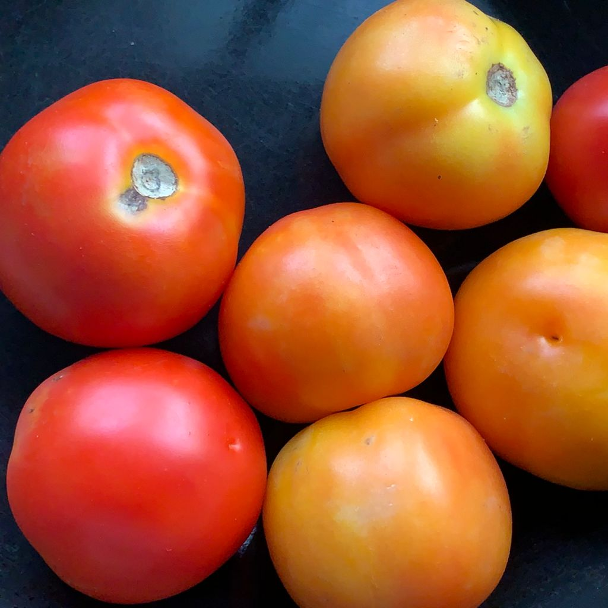

# Image to Text Art

## Converting a square image to ASCII Art.

For example, lets turn this image of Tomatoes into ASCII Art -




```
     ..........::::.....:::::::cxxx000x:
     ...........:::.....::::::cx00000000c.
    ....................:::::cx000000@@000:
  .......................:::cxx000000@@0000.
  .........................:cxx0000@@@@000@x
 ..........................:cxx00000@@00xx00c    .
. .......:::...............cccxxxx000000xx0@x. .::
  ....:cccccc:.............cccccxxxxx000xx000..:::
 ...:ccccxxxxcc...........:cccccccccxx0@0000x::::c
. .:ccccxxx00xcc:........ ::cccc:ccccx0@00@0x:::cc
 .:ccxxxxxxx00xxc:....... .:::::::ccxx000000x:::::
.:ccxx0x000xxx00cc:.....  .:::::::ccxxx00x00x::::.
::ccxxxx00xxxxx0xcc.       .::::::cccxxxxxxxx..:..
::cccxxx00xxxxxx0cc:       ..:::::::cccccccxc.....
:::ccccxx0x0xxxxxcc:.       .:::::::::cccccc: ....
:::::cccx0x00000xcc:.        .:::::::::::cc:  ....
:::::cccx0xx0000xcc:.      .......:::::::::.   ...
::::::ccx0000000xcc:   .:cccxcc:.....::::.      ..
:::::::ccx00000xccc:  :cxxxxxxxc:.  ....      ....
:::::::::cccxxxcccc: :xxx0xxx00xxc.       .:cxxxxx
::.:::::::ccccccccc..xxx00000000xxc.     :cxx00000
::.....:::::cccccc:.cxx0000000000xxc   .:cxx000000
.::......:::::::::::ccxx000000000xxc.  :ccxx000@@0
...........:::::::.:ccxxxxx000000xxcc :cccxx000000
 ...........::::...:cccxccxx000xxxxcc::ccccxxxxx00
  ............... .:cccccccxxxxxxcccc::cccccccxxxx
   ............   .::ccccccccxxxccccc::ccccccccxxx
      ........    .:::::::ccccccccccc::cccccc:ccxx
          ..      ..::::::::cccccccc:::ccccxxxcccx
       ...::::..   ..:::::::::cccccc.::cccccxxxxxc
     ::::ccccc:::  ....:::::::ccc::. ::ccccccxxxxx
   .ccccxxxxxcccc:. ....::::::cc::.  .::::cccccxxx
  .ccccxxxxxxxxxc::. ....::::::::.   .::::::cccccc
  ccccxx000xx00xxc:.  ....::.:cxxxxc. .::::::ccccc
 .ccccxx00xxx000xcc:.    .::ccxx00xxxc::::::::::cc
 :cccccxxxxxx000xcc::   .cxxxx00000xxxc..:::::::::
 :::ccccccccxxxxxccc:. .cxxx00000000xxxc...:::::::
.c:::::::ccccccccccc:. cxxx00000@0@0xxxc. ........
.::::::::::::ccccccc:::cxxx0000000@00xxxc  .......
.::::::::::::::::::::::cxxxx0000000@0xxxc.    ....
.::::::::::::::::::::::cxxxx000000000xxxx:
.::::::::::::::::::::.:cxxxxx00000000xxxxc
 ....:::::::::::::::..:ccxxxxxxxxxxxxxxxxc
  .....::::::::::::.. :ccccxxxxxxxxxxxxxxc
  ......:::::::::...  :cccccxxxxxxxxxxxxxc
   ................   .:ccccccccccccccccc:
    ..............     ::cccccccccccccccc:
     ...........       .:::ccccccccccccc:        .
       ........         .:::::::::::::::.       ..
.                       ..:::::::::::::.       ...
```

Usage:
```
>> python index.py DARKBACKGROUND NUMBEROFCHARACTERS
```
Where,
| Parameter  | Inputs | Notes |
| ------------- | ------------- | ----|
| DARKBACKGROUND  | 0 | Use this if you have your terminal background as light |
| DARKBACKGROUND  | 1 | Use this if you have your terminal background as dark |
| NUMBEROFCHARACTERS | Any number, eg: 50 | Number of characters you want your ASCII arts to be of |

Example usage command: 
```
>> python index.py 1 50
```


Python version used:
* Python 3.8.10

Packages used:
* Pillow 8.2.0
